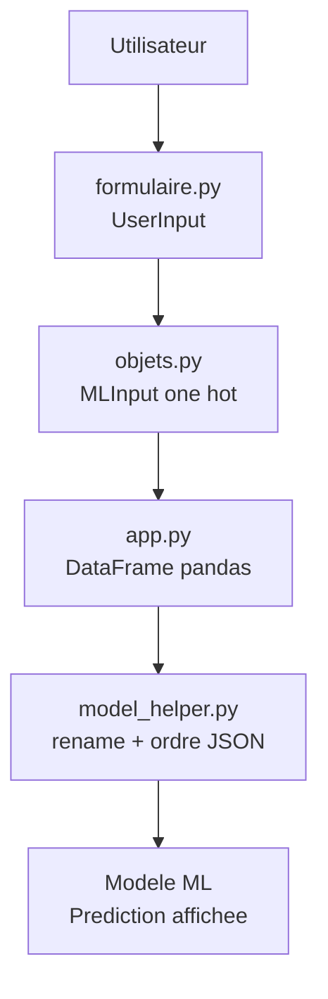

# 🏥 Guide de Construction : Application Web de Prédiction ML

> **Objectif** : Construire uniquement `002__model_webapp` avec **uv**.
> Le projet complet est disponible sur GitHub : https://github.com/agailloty/ALGOPY-26/

---

## 📚 Table des matières

1. [Vue d'ensemble](#vue-densemble)
2. [Prérequis](#prérequis)
3. [Architecture du projet](#architecture-du-projet)
4. [Étape 1 : Configuration](#étape-1--configuration)
5. [Étape 2 : Modélisation des données](#étape-2--modélisation-des-données)
6. [Étape 3 : Interface utilisateur](#étape-3--interface-utilisateur)
7. [Étape 4 : Gestion des modèles](#étape-4--gestion-des-modèles)
8. [Étape 5 : Application principale](#étape-5--application-principale)
9. [Étape 6 : Lancement](#étape-6--lancement)

---

## 🎯 Vue d'ensemble

Vous allez créer une application Streamlit qui prédit une prime d'assurance
à partir des caractéristiques d'un client. Les modèles ML sont déjà fournis.

```
Utilisateur → Formulaire → Encodage → DataFrame → Modèle → Prédiction
```

---

## 🚀 Démarrage rapide (Git + VS Code)

Exécutez les commandes suivantes dans un terminal :

```bash
git clone https://github.com/agailloty/ALGOPY-26.git
cd ALGOPY-26\002__model_webapp
code .
```

---

## 🔧 Prérequis

### Outils
- ✅ **Python 3.12+**
- ✅ **uv** installé
- ✅ VS Code (ou équivalent)

### Modèles ML disponibles (déjà fournis)
Le dossier suivant doit exister :

```
002__model_training/
└── models/
    ├── LinearReg_Model.pkl
    ├── ElasticNet_Model.pkl
    ├── GradientB_Model.pkl
    ├── AdaBoost_Model.pkl
    └── feature_names.json
```

> ✅ Aucun travail n'est requis dans `002__model_training`.

---

## 🏗️ Architecture du projet

### Vue d'ensemble

L'application est organisée en petits modules clairs :

- **objets.py** : structure des données (UserInput → MLInput)
- **formulaire.py** : interface utilisateur (sidebar Streamlit)
- **model_helper.py** : chargement des modèles + mapping des colonnes
- **app.py** : orchestration et affichage des prédictions

### Structure des fichiers

```
002__model_webapp/
├── pyproject.toml
├── objets.py
├── formulaire.py
├── model_helper.py
└── app.py
```

### Flux de données (du formulaire a la prediction)



> **Concept Focus**
> *Pourquoi cette séparation ?* Chaque fichier a un rôle unique, ce qui rend le projet plus lisible et facile à maintenir.

---

## ✅ Étape 1 : Configuration

### 1.1 Créer le fichier `pyproject.toml`

**Chemin** : `002__model_webapp/pyproject.toml`

```toml
[project]
name = "002-model-webapp"
version = "0.1.0"
description = "Application web de prédiction avec Machine Learning"
readme = "README.md"
requires-python = ">=3.12"
dependencies = [
    "scikit-learn==1.8.0",
    "streamlit>=1.54.0",
]
```

### 1.2 Installer les dépendances

Dans le dossier `002__model_webapp` :

```bash
uv sync
```

---

## ✅ Étape 2 : Modélisation des données

### 2.1 Créer le fichier `objets.py`

**Chemin** : `002__model_webapp/objets.py`

```python
from dataclasses import dataclass

@dataclass
class MLInput:
    """
    Données encodées au format attendu par les modèles ML.
    """
    age : int
    gender_male : bool
    annual_revenue : float
    marital_status_divorced : bool
    marital_status_single : bool
    number_dependents : float
    education_level_high_school : bool
    education_level_masters : bool
    education_level_phd : bool
    occupation_employed : bool
    occupation_unemployed : bool
    occupation_unknown : bool
    health_score : bool
    location_rural : bool
    location_suburban : bool
    policy_type_basic : bool
    policy_type_comprehensive : bool
    previous_claims : bool
    vehicle_age : bool
    insurance_duration : bool
    smoking_status_yes : bool
    exercise_frequency_daily : bool
    exercise_frequency_monthly : bool
    exercise_frequency_rarely : bool
    property_type_apartment : bool
    property_type_condo : bool

@dataclass
class UserInput:
    """
    Données brutes saisies par l'utilisateur.
    """
    age : int
    gender : str
    annual_revenue : float
    marital_status : str
    number_dependants : int
    education_level : str
    occupation : str
    health_score : float
    location : str
    policy_type : str
    previous_claims : int
    vehicle_age: int
    insurance_duration : int
    smoking_status : str
    exercise_frequency : str
    property_type : str

    def convert_to_mlinput(self) -> MLInput:
        """
        Convertit les données utilisateur en format ML (one-hot encoding).
        """
        mlinput = MLInput(
            age = self.age,
            annual_revenue = self.annual_revenue,
            gender_male = self.gender == "Homme",
            marital_status_divorced = self.marital_status == "Divorcé",
            marital_status_single = self.marital_status == "Célibataire",
            number_dependents= self.number_dependants,
            education_level_high_school= self.education_level == "Lycée",
            education_level_masters= self.education_level == "Master",
            education_level_phd= self.education_level == "Doctorat",
            occupation_employed= self.occupation == "Employé",
            occupation_unemployed= self.occupation == "Sans emploi",
            occupation_unknown= self.occupation == "Inconnu",
            health_score= self.health_score,
            location_rural= self.location == "Rural",
            location_suburban= self.location == "Semi-urbain",
            policy_type_basic= self.policy_type == "Basic",
            policy_type_comprehensive= self.policy_type == "Complet",
            previous_claims= self.previous_claims,
            vehicle_age= self.vehicle_age,
            insurance_duration= self.insurance_duration,
            smoking_status_yes= self.smoking_status == "Oui",
            exercise_frequency_daily= self.exercise_frequency == "Quotidien",
            exercise_frequency_monthly= self.exercise_frequency == "Mensuel",
            exercise_frequency_rarely= self.exercise_frequency == "Rarement",
            property_type_condo= self.property_type == "Copropriété",
            property_type_apartment= self.property_type == "Appartement"
        )
        return mlinput
```

---

## ✅ Étape 3 : Interface utilisateur

### 3.1 Créer le fichier `formulaire.py`

**Chemin** : `002__model_webapp/formulaire.py`

```python
import streamlit as st
from objets import UserInput

def get_forms() -> UserInput:
    """
    Affiche le formulaire et retourne un UserInput.
    """
    with st.sidebar:
        st.header("📝 Informations du client")

        st.subheader("Informations personnelles")
        age = st.number_input("Âge", min_value=15, max_value=100)
        gender = st.radio("Sexe", ["Homme", "Femme"])
        annual_revenue = st.number_input("Revenu annuel ($)", min_value=0)
        marital_status = st.selectbox(
            "Situation matrimoniale",
            ["Marié", "Célibataire", "Divorcé"]
        )
        number_dependants = st.number_input(
            "Nombre de personnes à charge",
            min_value=0,
            max_value=50
        )
        education_level = st.selectbox(
            "Niveau d'éducation",
            ["Lycée", "Licence", "Master", "Doctorat"]
        )

        st.subheader("Informations professionnelles")
        occupation = st.selectbox(
            "Situation professionnelle",
            ["Sans emploi", "Autoentrepeneur", "Employé", "Inconnu"]
        )

        st.subheader("Informations de santé")
        health_score = st.number_input("Score santé", min_value=0)
        smoking_status = st.radio("Fumeur", ["Non", "Oui"])
        exercise_frequency = st.selectbox(
            "Fréquence d'activité sportive",
            ["Mensuel", "Hebdomadaire", "Quotidien", "Rarement"]
        )

        st.subheader("Informations géographiques")
        location = st.selectbox(
            "Milieu géographique",
            ["Rural", "Semi-urbain", "Urbain"]
        )
        property_type = st.selectbox(
            "Type de propriété",
            ["Maison", "Appartement", "Copropriété"]
        )

        st.subheader("Informations sur l'assurance")
        policy_type = st.selectbox(
            "Police d'assurance",
            ["Complet", "Premium", "Basic"]
        )
        previous_claims = st.number_input("Nombre de réclamations", min_value=0)
        vehicle_age = st.number_input("Âge du véhicule", min_value=0)
        insurance_duration = st.number_input("Durée de l'assurance", min_value=0)

        user_input = UserInput(
            age,
            gender,
            annual_revenue,
            marital_status,
            number_dependants,
            education_level,
            occupation,
            health_score,
            location,
            policy_type,
            previous_claims,
            vehicle_age,
            insurance_duration,
            smoking_status,
            exercise_frequency,
            property_type
        )
    return user_input
```

---

## ✅ Étape 4 : Gestion des modèles

### 4.1 Créer le fichier `model_helper.py`

**Chemin** : `002__model_webapp/model_helper.py`

```python
from pathlib import Path
import pickle
import json

from sklearn.linear_model import LinearRegression, ElasticNet
from sklearn.ensemble import GradientBoostingRegressor, AdaBoostRegressor

rootPath = Path(__file__).parent
modelPaths = rootPath.parent / "002__model_training" / "models"

def get_feature_names() -> list:
    """
    Charge les noms de colonnes attendus par les modèles.
    """
    with open(modelPaths / 'feature_names.json', "r") as f:
        feature_names = json.load(f)
        return feature_names

def get_column_mapping() -> dict:
    """
    Mapping entre noms Python et noms du dataset d'entraînement.
    """
    return {
        'age': 'Age',
        'gender_male': 'Gender_Male',
        'annual_revenue': 'Annual Income',
        'marital_status_divorced': 'Marital Status_Divorced',
        'marital_status_single': 'Marital Status_Single',
        'number_dependents': 'Number of Dependents',
        'education_level_high_school': 'Education Level_High School',
        'education_level_masters': "Education Level_Master's",
        'education_level_phd': 'Education Level_PhD',
        'occupation_employed': 'Occupation_Employed',
        'occupation_unemployed': 'Occupation_Unemployed',
        'occupation_unknown': 'Occupation_Unknown',
        'health_score': 'Health Score',
        'location_rural': 'Location_Rural',
        'location_suburban': 'Location_Suburban',
        'policy_type_basic': 'Policy Type_Basic',
        'policy_type_comprehensive': 'Policy Type_Comprehensive',
        'previous_claims': 'Previous Claims',
        'vehicle_age': 'Vehicle Age',
        'insurance_duration': 'Insurance Duration',
        'smoking_status_yes': 'Smoking Status_Yes',
        'exercise_frequency_daily': 'Exercise Frequency_Daily',
        'exercise_frequency_monthly': 'Exercise Frequency_Monthly',
        'exercise_frequency_rarely': 'Exercise Frequency_Rarely',
        'property_type_apartment': 'Property Type_Apartment',
        'property_type_condo': 'Property Type_Condo'
    }

def get_linear_model() -> LinearRegression:
    with open(modelPaths / 'LinearReg_Model.pkl', "rb") as f:
        return pickle.load(f)

def get_elasticnet_model() -> ElasticNet:
    with open(modelPaths / 'ElasticNet_Model.pkl', "rb") as f:
        return pickle.load(f)

def get_boosting_model() -> GradientBoostingRegressor:
    with open(modelPaths / 'GradientB_Model.pkl', "rb") as f:
        return pickle.load(f)

def get_adaboost_model() -> AdaBoostRegressor:
    with open(modelPaths / 'AdaBoost_Model.pkl', "rb") as f:
        return pickle.load(f)
```

> **Concept Focus**
> *Pourquoi ?* Les modèles attendent exactement les mêmes noms de colonnes qu'à l'entraînement.
> *Comment ?* On renomme les colonnes puis on suit l'ordre dans `feature_names.json`.

---

## ✅ Étape 5 : Application principale

### 5.1 Créer le fichier `app.py`

**Chemin** : `002__model_webapp/app.py`

```python
import streamlit as st
from formulaire import get_forms
import model_helper as models
import pandas as pd

from dataclasses import asdict

st.set_page_config(
    page_title="Prédiction de Prime d'Assurance",
    page_icon="🏥",
    layout="wide"
)

st.title("🏥 Prédicteur de Prime d'Assurance")
st.markdown("""
Cette application utilise des modèles de machine learning pour estimer
le montant de votre prime d'assurance en fonction de vos caractéristiques personnelles.
""")

LINEAR_REGRESSION = "Régression linéaire"
ELASTIC_NET = "ElasticNet"
GRADIENT_BOOSTING = "Gradient Boosting"
ADABOOST = "AdaBoost"

MODEL_MAPPING = {
    LINEAR_REGRESSION: models.get_linear_model,
    ELASTIC_NET: models.get_elasticnet_model,
    GRADIENT_BOOSTING: models.get_boosting_model,
    ADABOOST: models.get_adaboost_model
}

st.subheader("🤖 Choisissez un modèle de prédiction")
selected_model = st.selectbox(
    "Modèle",
    ["--", LINEAR_REGRESSION, ELASTIC_NET, GRADIENT_BOOSTING, ADABOOST]
)

user_input = get_forms()

ml_data = asdict(user_input.convert_to_mlinput())
mlinput = pd.DataFrame([ml_data])

column_mapping = models.get_column_mapping()
mlinput = mlinput.rename(columns=column_mapping)

feature_names = models.get_feature_names()
mlinput = mlinput[feature_names]

if selected_model != "--":
    model = MODEL_MAPPING[selected_model]()
    prediction_value = model.predict(mlinput)[0]

    st.success(f"### 💰 Prédiction : {prediction_value:.2f} $")

    st.info(f"""
    **Modèle utilisé** : {selected_model}

    Le montant estimé de votre prime d'assurance est de **{prediction_value:.2f} $**.
    """)

st.markdown("---")
if st.checkbox("📊 Comparer tous les modèles"):
    st.subheader("Comparaison des prédictions")

    col1, col2, col3, col4 = st.columns(4)

    with col1:
        st.metric(
            label="🔹 Régression Linéaire",
            value=f"{models.get_linear_model().predict(mlinput)[0]:.2f} $"
        )

    with col2:
        st.metric(
            label="🔹 ElasticNet",
            value=f"{models.get_elasticnet_model().predict(mlinput)[0]:.2f} $"
        )

    with col3:
        st.metric(
            label="🔹 Gradient Boosting",
            value=f"{models.get_boosting_model().predict(mlinput)[0]:.2f} $"
        )

    with col4:
        st.metric(
            label="🔹 AdaBoost",
            value=f"{models.get_adaboost_model().predict(mlinput)[0]:.2f} $"
        )

    st.info("""
    **💡 Conseil** : Les différences entre modèles montrent l'incertitude de la prédiction.
    Un écart important peut indiquer un profil atypique.
    """)
```

> **Concept Focus**
> *Pourquoi pandas ?* Un DataFrame conserve les noms de colonnes attendus par les modèles.
> *Resultat* : plus d'avertissement "feature names" et une prediction fiable.

---

## ✅ Étape 6 : Lancement

Dans `002__model_webapp` :

```bash
uv run streamlit run app.py
```

---
